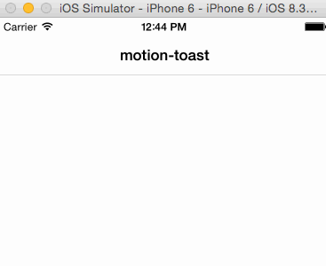

# motion-toast
[](https://rubygems.org/gems/motion-toast)
[](https://travis-ci.org/skellock/motion-toast)

A RubyMotion library for iOS 7+ to display Toast-like notification messages.

The heavy lifting is provided by CRToast.  It's pretty awesome.  motion-toast is just a warm RubyMotion hug for it.

https://github.com/cruffenach/CRToast




# Installation

Add this to your Gemfile:

```ruby
gem 'motion-toast'
```

Then run this to install it:

```
bundle
```

# Requirements

* iOS 7 or higher


# Usage

Include the MotionToast module in your file.  We're non-polluting by default.

```ruby
include MotionToast
```

Simple and unstyled.
```ruby
toast "Look up.  Look wayyyyyyy up."
```

Passing in some options to customize it.
```ruby
toast "And Blueberry Jam", bg_color: UIColor.blueColor

```

There are 3 types of toasts.

```ruby
toast "Small", type: :status_bar
toast "Bigger", type: :navigation_bar
toast "What have you done?", type: :custom, preferred_height: 300
```

Text can be customized.
```ruby
toast type: :custom,
  preferred_height: 100,
  text: {
    value: "And Peanut Butter",
    color: UIColor.brownColor,
    font:  UIFont.systemFontOfSize(20)
    }
```

Subtitles are supported just like text.  And styled the same way.
```ruby
toast type:     :notification,
      bg_color: UIColor.whiteColor,
      text:     {value: "With Bacon", color: UIColor.brownColor},
      subtitle: {value: "And Eggs", color: UIColor.yellowColor}
```

You can use an image.

```ruby
toast type: :custom,
  preferred_height: 100,
  image: UIImage.imageNamed("syrup"),
  text: "Yum."
```

# Customizable Properties

`toast` can take a Hash as an argument.  Here's what you can do so far.  More is on the way.

```ruby

  type                         # What type of notification to show?
                               #   :status_bar     - cover the status bar
                               #   :navigation_bar - cover the navigation bar
                               #   :custom         - roll your own size

  preferred_height             # How many points high is the toast?
                               #   Fixnum
                               #   only works with type: :custom

  presentation_type            # What to do with overlapping pixels?
                               #   :push - shove them out of the way
                               #   :cover - walk over them
                               #   default is :push

  duration                     # How long to display the toast before auto-closing.
                               #   Float

  under_status_bar             # Always keep under the iOS status bar?
                               #   boolean - default false

  keep_navigation_bar_border   # Keep the toast contained with the nav bar?
                               #   boolean - default true

  in_animation                 # a Hash for customizing the arrival of the toast.
    type                       # the animation timing style
                               #   :linear  - constant speed
                               #   :spring  - bounces like a spring
                               #   :gravity - behaves like gravity
    direction                  # the direction the animation comes from
                               #   :top     - death from above
                               #   :bottom  - kinda wierd, from below
                               #   :left    - from the left
                               #   :right   - from the right
                               #   default is :top
    time                       # animation duration (float default 0.3)

  out_animation                # a Hash for customizing the departure of the toast.
    type                       # the animation timing style
                               #   :linear  - constant speed
                               #   :spring  - bounces like a spring
                               #   :gravity - behaves like gravity
    direction                  # the direction the animation comes from
                               #   :top     - leave through the ceiling
                               #   :bottom  - kinda wierd, sink through the floor
                               #   :left    - to the left
                               #   :right   - to the right
                               #   default is :top
    time                       # animation duration (float default 0.3)

  spring_damping               # how much resistance the :spring animations have (float default 0.6)
  spring_initial_velocity      # how much initial velocity the :spring animations have (float default 1.0)
  gravity                      # how much gravity the :gravity animations have (float default 0.1)

  text                         # what the message says (optionally can be a string if not customizations are needed)
    value                      # the message
    color                      # a UIColor
    font                       # a UIFont
    shadow_color               # a UIColor
    shadow_offset              # a CGSize or a float if you're lazy
    max_lines                  # :unlimited or a fixnum to cap wrapping.
    alignment                  # how to align the text
                               #   :left   - <-- that way
                               #   :right  - --> this way
                               #   :center - in the middle
                               #   default is :center

  subtitle                     # what the subtitle says (optionally can be a string if not customizations are needed)
    value                      # the message
    color                      # a UIColor
    font                       # a UIFont
    shadow_color               # a UIColor
    shadow_offset              # a CGSize or a float if you're lazy
    max_lines                  # :unlimited or a fixnum to cap wrapping.
    alignment                  # how to align the text
                               #   :left   - <-- that way
                               #   :right  - --> this way
                               #   :center - in the middle
                               #   default is :center

  background_color             # UIColor of the background.  Semi-transparent colors look neato.

  background_view              # optional UIView placed behind the images and labels.
                               #   if you set this, consider setting :bg_color = UIColor.clearColor

  image                        # an optional UIImage or Hash
    value                      #   the UIImage to display
    alignment                  # how to align the text
                               #   :left   - <-- that way
                               #   :right  - --> this way
                               #   :center - in the middle
                               #   default is :left
    content_mode               # a UIViewContentMode type.
                               #   :scale_to_fill
                               #   :scale_aspect_fit
                               #   :scale_aspect_fill
                               #   :redraw
                               #   :center
                               #   :top
                               #   :bottom
                               #   :left
                               #   :right
                               #   :top_left
                               #   :top_right
                               #   :bottom_left
                               #   :bottom_right
                               #   default is :center

```

# Wierd Things

* So not all combinations of options work with each other.  CRToast might throw some warnings in your console to reward your conflicting choices.  No big deal.
* motion-toast uses the Pod CRToast but links it from Github on the master branch.  Never do this at home.  I'll fix.

# HISTORY

### 0.1.0 | June 6th, 2015
* [feature] first release


