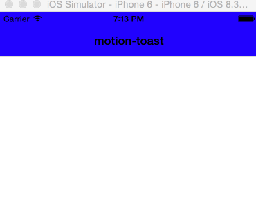

# motion-toast
[](https://rubygems.org/gems/motion-toast)
[](https://travis-ci.org/skellock/motion-toast)

A RubyMotion library for iOS 7+ to display Toast-like notification messages.




# Installation

Add this to your Gemfile:

```ruby
gem 'motion-toast'
```

Then run this to install it:

```
bundle
```

# Requirements

* iOS 7 or higher


# Usage

```ruby
include MotionToast
```


# HISTORY

### 0.1.0 | June 5th, 2015
* [feature] first release


